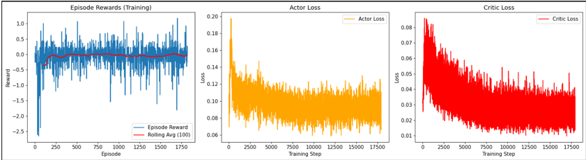

# Image-Processing-RL-Agent
A RL agent that Learn appropriate Preprocessing factors to be applied to images such that it can improve the performance of Yolov5 predictions of Various objects 

---
## Part A : **Custom gym Environment with Continuous Actions**
## Continuous Action Space Design
In this project, the action space is a continuous vector representing image transformation parameters. The values in these vectors are continuous values bounded within a range and the actor is able to select a float value from this range to take actions in the environment.
Each dimension of the action vector corresponds to a preprocessing parameter:
  - action[0] - Brightness | `[-1, 1]` | Adjusts pixel intensity
  - action[1] - Contrast | `[-1, 1]` | Modifies image contrast
  - action[2] - Sharpness | `[0, 1]` | Sharpens or blurs the image
    
---
## Actor-Critic Architecture (From Scratch)
I've implemented an Actor-Critic network in PyTorch without using pre-built RL frameworks like Stable Baselines3.  

### Actor Network  [no_states - 256 - 256 - no_actions]
- **Input:** Image state representation  
- **Hidden Layers:** 2 fully connected layers with ReLU activation  
- **Output:** Continuous action vector (via `tanh` or `sigmoid `)  

### Critic Network  [no_states - (256 + no_action) - 256 - 1]
- **Input:** Concatenation of state and action  
- **Hidden Layers:** 2 fully connected layers with ReLU activation  
- **Output:** Q-value estimate for the given (state, action) pair  

### Learning Algorithm
-  TD3 Algorithm
  
## Training Loop
For each episode:
1. **Environment Reset** : Receive initial state.  
   
2. **Action Selection** : Actor predicts an action from the current state. After adding Noise Exploration earlier on and more exploitation later in training.  

3. **Environment Step** : Apply action -> receive `(next_state, reward, done, info)` from environment.  

4. **Replay Buffer Storage** : Store `(state, action, reward, next_state, done)` in memory.  

5. **Network Updates** *(if buffer > batch_size)*  
   - **Critic Update**  
     - **Target Q-value**:  *target_Q = rewards + GAMMA * (1 - dones) * target_Q*
     - Minimize MSE between `current_Q` and `target_Q`.  
     - Add clipped Gaussian noise to target actor’s next action (policy smoothing).
     - Update both critics by minimizing **MSE loss** between predicted Q-values `(Q1, Q2)` and `target_Q`.  
     - Store critic loss (minimum of both critics).  
       
   - **Actor Update** *(delayed by `policy_delay` steps)*
     - Backpropagate and update the actor parameters.  
     - Store actor loss.  
     - Loss is negative mean of critic(states, actor(states)).
       
   - **Soft Update** of target networks after Actor update.
     - After actor update, softly update target networks using Polyak averaging
     
---
## Training Reward Plot

Below is the cumulative reward per episode recorded during training.  

---
## Observations & Analysis

### Did the agent learn meaningful transformations?
The agent did learn useful transformations for many images.  
It often increased brightness, contrast, or sharpened images that originally had low YOLO detection confidence.
We can see this as:
- **Qualitative samples** showing processed images with more confident detections and sometimes even more detected objects.
- **Episode reward** — shows the agent’s episodic Rewards improving.
- **Actor and Critic Loss** - shows the actors and critics loss decreasing as training improves. 
- **5×2 qualitative grid** — visually compares original vs processed detections.

---

### Primary challenges encountered with continuous control

#### 1. Reward noise & instability
- YOLO confidences were changing by huge amounts for small changes to the image giving noisy rewards.  

--- 
## Part B: Report and Analysis

### Before-and-After Image Results
Below is a 5×2 grid showing original images (left) and their processed versions after the RL agent’s transformations (right):
- 

---

### Analysis

 - The continuous Actor-Critic policy successfully enhanced some images by adjusting brightness, contrast, and sharpness to improve YOLOv5’s object detection confidence. In some images as shown in the grid, the model performs worse in situations where there are a lot of objects to be detected or cluttered backgrounds.

---
### Continuous vs. Discrete Policy
 - Continuous Policy allows fine control over transformations, enabling minute adjustments per step. Harder to learn stable behavior due to large action space and sensitivity to scaling. Whereas Discrete policy is easier to train and can be set to have fewer over-adjustments. Fixed adjustments values may not converge to optimal transformations for each image. With enough episodes a continuous policy can perform better as compared to a discrete one 

---

### Failure Modes
  - Over adjustments in already well-optimized images causing yolo confidence to drop.
  - Sensitivity to YOLO confidence noise — minor fluctuations can mislead the reward.  

---

### Agent Improvements
- The agent could be improved by trying other algorithms such as TD3 or any other continuous policy agents.
- Better balance between detection count and confidence improvement.
- Penalize overly aggressive changes that hurt visual quality.
- Hyperparameter tuning for better learning.
